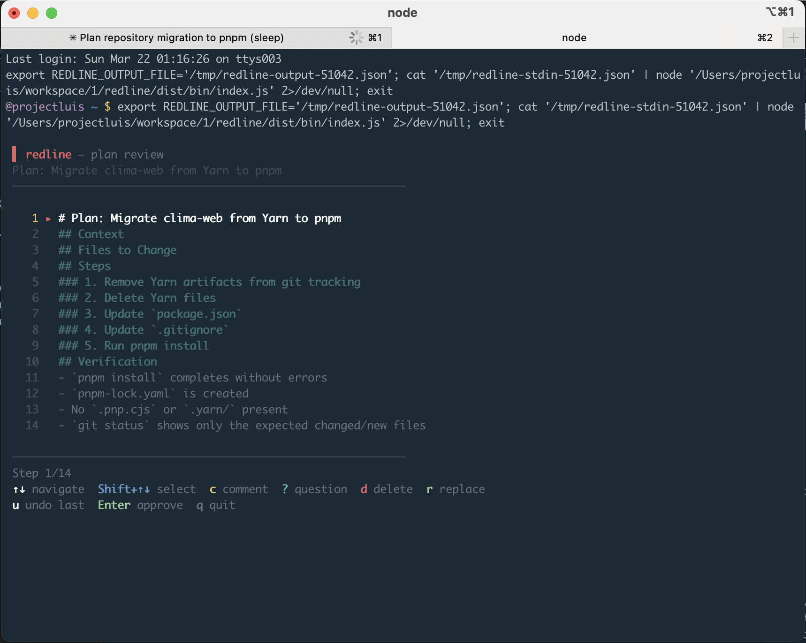
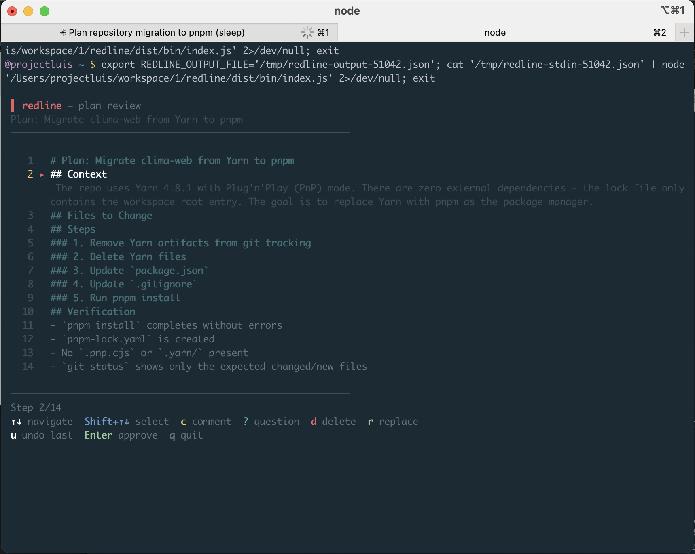
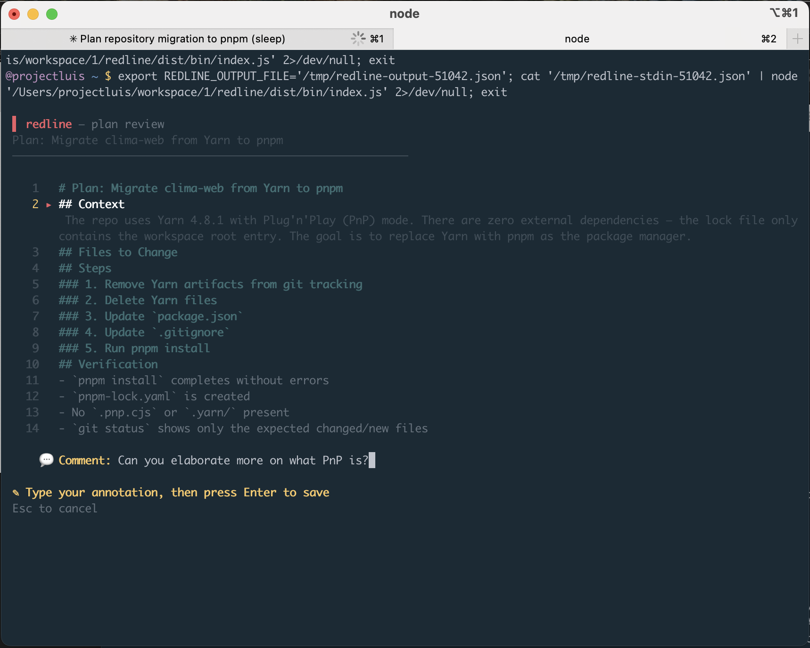
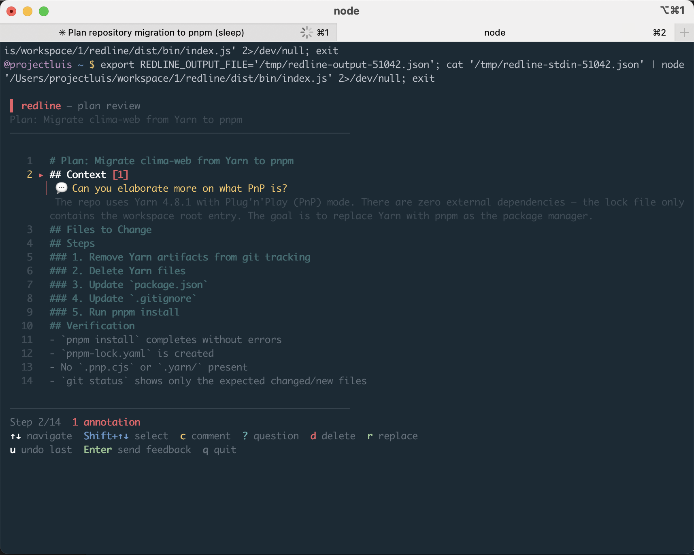
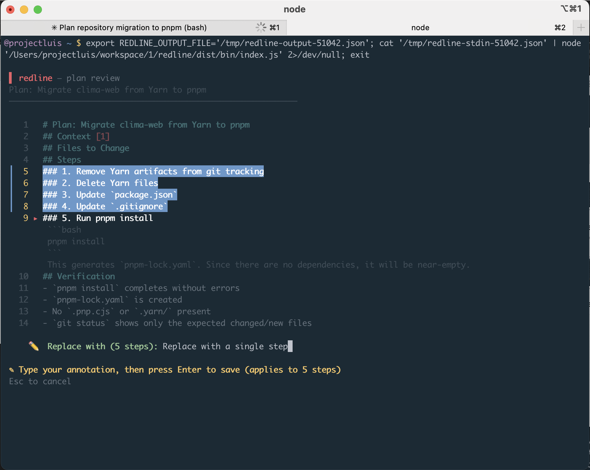
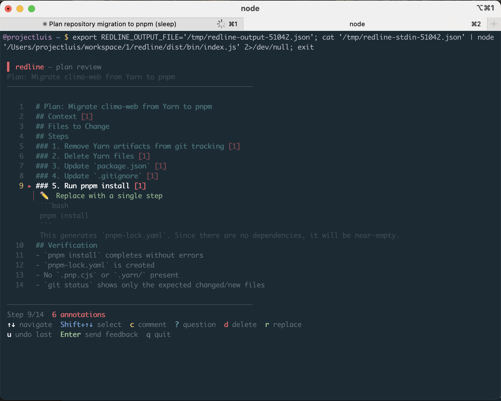
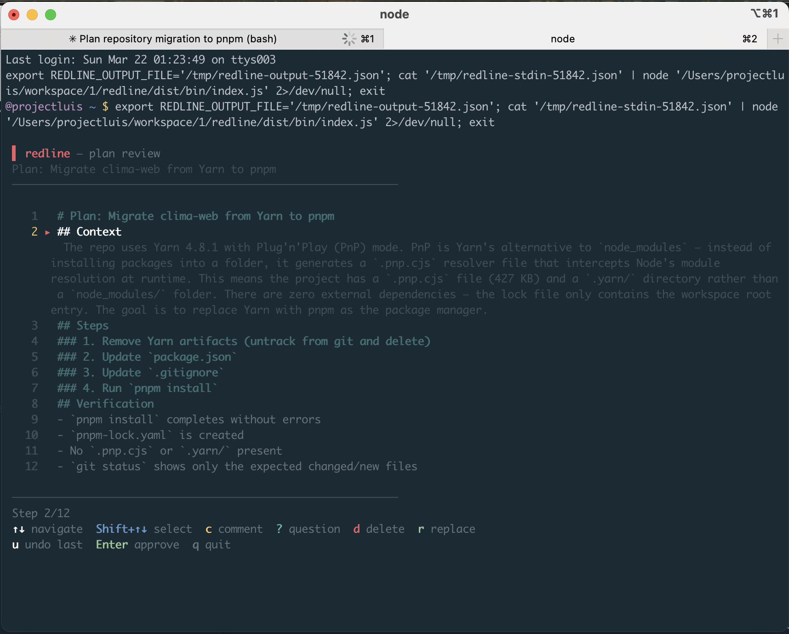
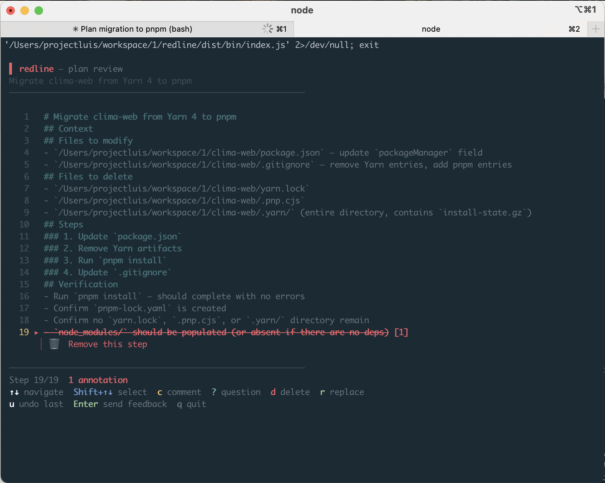

# redline

Terminal-native plan annotator for [Claude Code](https://docs.anthropic.com/en/docs/claude-code). Review, comment, and redline AI-generated plans without leaving your terminal.

```
▌ redline — plan review
Plan: Migrate clima-web from Yarn 4 to pnpm
────────────────────────────────────────────────────────
 1   # Plan: Migrate clima-web from Yarn 4 to pnpm
 2   ## Context
 3   ## Steps
 4   ### 1. Delete Yarn-specific files
 5   - `.pnp.cjs` — Yarn PnP runtime
 6   - `.yarn/` — contains `install-state.gz`
 7   - `yarn.lock` — Yarn lockfile
 8 ▸ ### 2. Update `package.json`                    [1]
 │   💬 Use pnpm --version to get the exact version
 9   ### 3. Update `.gitignore`
10   ### 4. Install dependencies with pnpm
11   ## Files modified
12   ## Verification                                  [5]
────────────────────────────────────────────────────────
Step 8/15  5 annotations
↑↓ navigate  Shift+↑↓ select  c comment  ? question  d delete  r replace
u undo last  Enter send feedback  q quit
```

## Demo

**Plan loads — all steps visible at a glance**


**Navigate to a step to expand its full content**


**Press `c` to add a comment — type and hit Enter**


**Comment saved — badge shows annotation count, text visible inline**


**`Shift+↑↓` to multi-select steps, then `r` to replace them all at once**


**Overview after annotating — badges across 6 steps**


**Press `Enter` — Claude receives your feedback and revises the plan**


**redline intercepts the revised plan — annotate again or approve**


## Why

Claude Code's plan mode is powerful, but reviewing and giving feedback on plans is painful. You have to read the plan, then type out references to specific steps when you have comments. VS Code extensions solve this with inline annotations, but if you work in the terminal, you're out of luck.

**redline** hooks directly into Claude Code's plan lifecycle. When Claude finishes a plan, redline intercepts it and opens an interactive TUI where you can navigate steps, add comments, flag questions, mark deletions, and suggest replacements — then send all your feedback back to Claude with a single keypress.

## Features

- **Zero context switching** — stays in your terminal, no browser
- **Inline annotations** — comment, question, delete, or replace any step
- **Multi-select** — `Shift+↑↓` to select a range, annotate all at once
- **Smart submit** — `Enter` approves if clean, sends feedback if annotated
- **Delete toggle** — `d` marks/unmarks steps for deletion (no stacking)
- **Visual hierarchy** — headings render in cyan, body content in gray
- **Automatic hook** — intercepts `ExitPlanMode` via Claude Code's `PermissionRequest` hook
- **Feedback loop** — Claude receives structured feedback and revises the plan; redline intercepts again

## Install

```bash
git clone https://github.com/YOUR_USERNAME/redline.git
cd redline
pnpm install
pnpm build
chmod +x redline-hook.sh
```

## Setup

Add the hook to `~/.claude/settings.json`, using the **absolute path** to your `redline-hook.sh`:

```json
{
  "hooks": {
    "PermissionRequest": [
      {
        "matcher": "ExitPlanMode",
        "hooks": [
          {
            "type": "command",
            "command": "/absolute/path/to/redline/redline-hook.sh",
            "timeout": 300
          }
        ]
      }
    ]
  }
}
```

**Restart Claude Code** after adding the hook.

### Why a wrapper script?

Claude Code hooks run as background processes without a TTY (no terminal attached). An interactive TUI like Ink needs a real terminal for keyboard input and screen rendering. `redline-hook.sh` bridges this gap: it saves the plan data, opens a new terminal tab, runs the TUI there, and pipes your response back to Claude Code when you're done.

## Usage

### With Claude Code (automatic)

1. Enter plan mode in Claude Code (`Shift+Tab`)
2. Give Claude a task — it generates a plan
3. When Claude calls `ExitPlanMode`, redline opens in a new terminal tab
4. Review and annotate the plan
5. Press `Enter` — the tab closes and Claude receives your feedback
6. Claude revises the plan → redline intercepts again for another review cycle

### Demo mode (standalone)

```bash
# Run with a built-in sample plan
node dist/bin/index.js

# Pipe a custom plan (simulates Claude Code's hook payload)
jq -n '{
  session_id: "test",
  tool_name: "ExitPlanMode",
  tool_input: {
    plan: "# My Plan\n## Step 1\nDo something\n## Step 2\nDo another thing"
  }
}' | node dist/bin/index.js
```

### Testing with a realistic plan

A multi-phase plan with embedded code snippets (SQL, TypeScript, TSX) is included for manual testing:

```bash
pnpm build
jq -n --rawfile plan test-plan.md \
  '{session_id:"test",tool_name:"ExitPlanMode",tool_input:{plan:$plan}}' \
  | node dist/bin/index.js
```

This exercises heading hierarchy, inline code, fenced code blocks, and multi-line step content. See [`test-plan.md`](test-plan.md) for the full plan.

## Keybindings

| Key | Action |
|-----|--------|
| `↑` / `↓` or `j` / `k` | Navigate between steps |
| `Shift+↑` / `Shift+↓` | Extend selection (multi-select) |
| `c` | Add a comment to the current step (or selection) |
| `?` | Flag a step with a question |
| `d` | Toggle delete mark (press again to unmark) |
| `r` | Suggest a replacement for a step |
| `u` | Undo the last annotation on the current step |
| `Esc` | Cancel annotation input / clear selection |
| `Enter` | Submit — approves if no annotations, sends feedback if annotated |
| `q` | Quit without sending anything |

## How feedback works

When you annotate steps and press `Enter`, redline formats your annotations into structured feedback that Claude can act on:

```
Plan feedback from redline review:

On step: "### 2. Update `package.json`"
  💬 Comment: Use pnpm --version to get the exact installed version

On step: "### 3. Update `.gitignore`"
  ❓ Question: Should we also add .pnpm-debug.log?

On step: "## Verification"
  🗑️  Remove this step: We'll verify manually

Please revise the plan addressing the above annotations, then present the updated plan.
```

Claude then revises the plan and presents it again. Redline intercepts for another review cycle until you approve.

## Supported terminals

| Terminal | Platform | Status |
|----------|----------|--------|
| iTerm2 | macOS | ✅ Opens a new tab in current window |
| Terminal.app | macOS | ✅ Fallback |
| gnome-terminal | Linux | ✅ |
| kitty | Linux | ✅ |
| alacritty | Linux | ✅ |

## Requirements

- Node.js 20+
- pnpm
- Claude Code 2.1+

## Roadmap

- [ ] Reorder steps (`Shift+j/k`)
- [ ] Add new steps inline
- [ ] Plan diffing between revision cycles
- [ ] Persistent annotation history
- [ ] `curl | bash` install script
- [ ] npm/Homebrew distribution
- [ ] Team sharing via URL

## License

MIT
